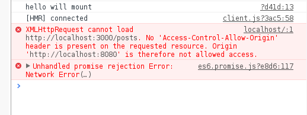
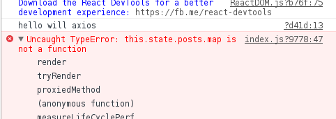

### 实现express路由

 express路由：跑在服务器上 响应客户端发出的request 决定哪部分后台代码执行

### 学会用curl调试API
```js
curl --request PUT localhost:3000/posts/1234
```
### API：就是一个请求 verb+path

1. API是由当前程序提供出来的
2. 提供给另一个程序的开发者来使用的
3. 作为前端开发者，我们所说的是Web API


[mongoose](http://haoqicat.com/react-express-api/3-mongoose)
#### 2.建立代码和数据库的链接
```js
mongoose.connect('mongo://')
db.on('')
```
#### 3.创建schema在models/post.js
#### 4.创建model
```js
module.exports = mongoose.model('Post',PostSchema)
```
#### 5.导入 Post model
#### 6.实例化 Post model 得到 post 这个对象
#### 7.保存 post 到数据库


### API
重定向redirect

### 问题：

 客户端和服务器端域名相同，同时端口也要相同




```js
this.state={
  posts:"" 改成 posts:[]
}
```
